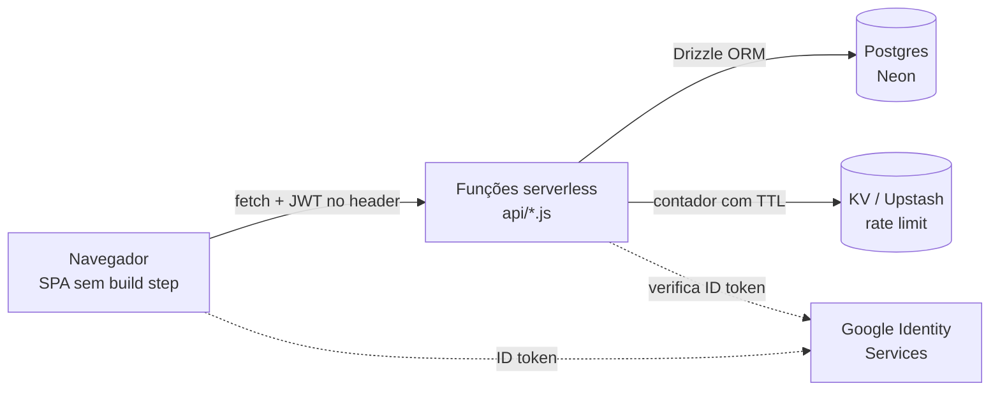

# Vell Financing

_Controle financeiro pessoal em pt-BR: lançamentos, orçamento, metas e investimentos, com import de extrato bancário OFX/CSV._

<!-- [PREENCHER: badges reais — sugestão: badge do workflow CI (.github/workflows/ci.yml), licença MIT, Node 20+. Máximo 5. Não adicionar badges decorativas de linguagem.] -->

<!-- [PREENCHER: URL da demo pública na Vercel. Assim que existir, esta linha vira: "Demo ao vivo · Código · Autor" e a demo abre em modo `?demo`, que não exige conta.] -->

<!-- [PREENCHER: GIF de 10-15s ou screenshot do fluxo principal (Visão Geral → novo lançamento → gráfico atualizado), com alt text descrevendo a função da tela. URL absoluta. Sem isso o leitor de um app com UI não vê o produto.] -->

## Índice

- [Sobre](#sobre)
- [Funcionalidades](#funcionalidades)
- [Stack e ferramentas](#stack-e-ferramentas)
- [Arquitetura](#arquitetura)
- [Como executar](#como-executar)
- [API](#api)
- [Testes](#testes)
- [Decisões técnicas e trade-offs](#decisões-técnicas-e-trade-offs)
- [Estrutura de pastas](#estrutura-de-pastas)
- [Limitações conhecidas](#limitações-conhecidas)
- [Status e roadmap](#status-e-roadmap)
- [Aprendizados](#aprendizados)
- [Licença](#licença)
- [Autor](#autor)

## Sobre

Planilha de controle financeiro quebra em três pontos: não sincroniza entre dispositivos, não importa extrato do banco e não sobrevive a um arquivo corrompido. O Vell Financing resolve esses três pontos para uso individual.

O sistema guarda lançamentos, orçamento mensal, metas e investimentos em Postgres, expõe uma API serverless por recurso, e importa extrato bancário em OFX ou CSV com categorização automática e deduplicação por hash. Cada conta é single-user: toda query é escopada pelo `user_id` do token JWT.

O projeto é pessoal e serve também como vitrine técnica — a trilha completa de decisões, alternativas descartadas e limitações aceitas está em [ROADMAP.md](./ROADMAP.md).

## Funcionalidades

- Registra receitas e despesas com categoria, data e status de pagamento, em sete telas (Visão Geral, A Pagar, Histórico, Orçamento, Metas, Investimentos, Configurações).
- Importa extrato bancário em OFX ou CSV, categoriza por descrição e ignora lançamentos já importados (hash por conteúdo).
- Define orçamento por categoria e acompanha o consumo do mês.
- Acompanha metas de economia e aportes em investimentos.
- Exporta os dados em Excel (`xlsx`) e PDF, e gera backup completo em JSON restaurável.
- Sincroniza entre dispositivos: os dados vivem no Postgres, não no navegador.
- Aceita login com e-mail/senha ou com Google (Google Identity Services, ID token verificado no backend).
- Abre em modo demonstração somente-leitura com `?demo` na URL, sem conta e sem backend.

## Stack e ferramentas

| Camada       | Ferramenta                                        | Por quê                                                                                                                 |
| ------------ | ------------------------------------------------- | ----------------------------------------------------------------------------------------------------------------------- |
| Frontend     | HTML + CSS + JavaScript (scripts clássicos)       | Sem build step: o que está no repositório é o que roda no navegador. Ver [trade-offs](#decisões-técnicas-e-trade-offs). |
| Gráficos     | Chart.js (vendorizado)                            | Carregado sob demanda por `js/loader.js`, nunca no load inicial.                                                        |
| Planilhas    | SheetJS `xlsx` 0.20.3 (vendorizado)               | Versão do CDN oficial; a última publicada no npm tem duas vulnerabilidades altas sem correção.                          |
| Backend      | Funções serverless Vercel (Node.js, CommonJS)     | Uma função por recurso, sem servidor de longa duração para manter.                                                      |
| Banco        | Postgres (Neon) + Drizzle ORM                     | Schema versionado em JavaScript, migrações SQL geradas por `drizzle-kit`.                                               |
| Cache        | Vercel KV / Upstash Redis                         | Usado só para contadores de rate limit com TTL.                                                                         |
| Autenticação | `jsonwebtoken`, `bcryptjs`, `google-auth-library` | JWT no cliente, hash de senha com bcrypt, verificação do ID token do Google no servidor.                                |
| Testes       | `node:test` (runner nativo)                       | Sem dependência de framework de teste.                                                                                  |
| Qualidade    | ESLint (flat config) + Prettier + GitHub Actions  | `lint`, `format:check` e `test` rodam em todo push e PR para `main`.                                                    |

Requer **Node.js 20 ou superior**.

## Arquitetura



O navegador guarda o JWT e o envia em toda chamada. Cada função serverless valida o token, valida o payload (tipos e tamanho máximo de string) e monta a query já escopada pelo `user_id` extraído do token — nenhum endpoint confia num id de recurso enviado pelo cliente sem checar o dono. Os endpoints de autenticação passam antes por um contador de rate limit por IP + usuário no KV; se o KV estiver indisponível, o contador falha aberto e a requisição segue. Chart.js e `xlsx` só são baixados quando a tela que os usa é aberta.

## Como executar

### Pré-requisitos

- Node.js 20 ou superior
- [Vercel CLI](https://vercel.com/docs/cli) (`npm i -g vercel`), para rodar as funções serverless localmente
- Acesso ao projeto na Vercel, para baixar as variáveis de ambiente

### Passos

Instale as dependências:

```bash
npm install
```

Baixe as variáveis de ambiente do projeto na Vercel para o `.env.local`:

```bash
vercel env pull --yes
```

Aplique o schema no banco (primeira execução e após qualquer mudança em `db/schema.js`):

```bash
npx dotenv -e .env.local -- npx drizzle-kit push
```

Suba o frontend e as funções serverless:

```bash
npm run dev:vercel
```

### Validando que funcionou

Abra `http://localhost:3000`. A tela de login deve aparecer. Para conferir o app sem criar conta nem depender do banco, abra `http://localhost:3000/?demo` — o modo demonstração usa dados fictícios em memória.

Sem a Vercel CLI, `index.html`, `css/`, `js/` e `vendor/` são arquivos estáticos e podem ser servidos por qualquer servidor (`npx serve .`). Nesse caso só o modo `?demo` funciona, porque não há API no ar.

### Variáveis de ambiente

Os nomes estão em [`.env.example`](./.env.example). Nunca comite valores reais.

| Variável                                              | Obrigatória          | Descrição                                                                                                                                                                                                                     |
| ----------------------------------------------------- | -------------------- | ----------------------------------------------------------------------------------------------------------------------------------------------------------------------------------------------------------------------------- |
| `DATABASE_URL`                                        | Sim                  | Connection string do Postgres. Provisionada ao instalar a integração Neon pelo Vercel Marketplace (`vercel integration add neon`).                                                                                            |
| `JWT_SECRET`                                          | Sim em produção      | Segredo para assinar e verificar tokens. Sem ela, `lib/auth.js` recusa operar quando `VERCEL_ENV` ou `NODE_ENV` é `production`. Fora de produção usa um valor de desenvolvimento inseguro, só para não travar o `vercel dev`. |
| `KV_REST_API_URL` / `KV_REST_API_TOKEN`               | Não                  | Credenciais do KV usado nos contadores de rate limit. Ausentes, o rate limiting fica desligado e o restante funciona.                                                                                                         |
| `UPSTASH_REDIS_REST_URL` / `UPSTASH_REDIS_REST_TOKEN` | Não                  | Mesma função, nomes usados quando o KV vem de uma integração Upstash direta.                                                                                                                                                  |
| `GOOGLE_CLIENT_ID`                                    | Só para login Google | Client ID OAuth usado para validar o ID token no backend. Ausente, o endpoint de login com Google responde 500.                                                                                                               |

### Login com Google

Não é uma integração do Marketplace: precisa ser criada no Google Cloud Console.

1. [Google Cloud Console](https://console.cloud.google.com/) → **APIs & Services → Credentials → Create Credentials → OAuth client ID** → tipo **Web application**.
2. Em **Authorized JavaScript origins**, adicione a URL do app e `http://localhost:3000`.
3. Copie o **Client ID**. O Client Secret não é necessário — o fluxo usa Google Identity Services com ID token verificado no servidor.
4. Backend: `vercel env add GOOGLE_CLIENT_ID`.
5. Frontend: cole o mesmo Client ID em `GOOGLE_CLIENT_ID`, no topo de `js/auth.js`. O valor é público. Sem ele, o botão "Entrar com Google" não aparece.

## API

Todas as rotas exigem `Authorization: Bearer <jwt>`, exceto `/api/auth`.

| Rota                | Métodos                | Descrição                                                                        | Auth |
| ------------------- | ---------------------- | -------------------------------------------------------------------------------- | ---- |
| `/api/auth`         | POST                   | Ações via `?action=`: `login`, `register`, `google`, `forgot`, `reset`, `change` | Não  |
| `/api/transactions` | GET, POST, PUT, DELETE | CRUD de lançamentos                                                              | Sim  |
| `/api/categories`   | GET, POST, PUT, DELETE | CRUD de categorias                                                               | Sim  |
| `/api/goals`        | GET, POST, PUT, DELETE | CRUD de metas                                                                    | Sim  |
| `/api/investments`  | GET, POST, PUT, DELETE | CRUD de investimentos                                                            | Sim  |
| `/api/budgets`      | GET, PUT               | Leitura e atualização do orçamento por categoria                                 | Sim  |
| `/api/import`       | POST                   | Importa lançamentos de extrato, com deduplicação por hash                        | Sim  |
| `/api/search`       | GET                    | Busca lançamentos                                                                | Sim  |
| `/api/account`      | GET, POST              | Ações via `?action=`: `stats`, `export` (GET); `restore`, `clear-all` (POST)     | Sim  |

<!-- [PREENCHER: um par requisição/resposta real em JSON de `POST /api/transactions`, copiado de uma chamada de verdade. É o que prova que a API existe e funciona.] -->

## Testes

```bash
npm test
```

O runner nativo do Node executa 30 testes em `test/`:

| Arquivo                  | O que cobre                                                                      |
| ------------------------ | -------------------------------------------------------------------------------- |
| `test/auth.test.js`      | Assinatura e verificação de JWT, comportamento sem `JWT_SECRET`, rate limiting   |
| `test/extrato.test.js`   | Parsing de OFX e CSV, incluindo o caso do delimitador vírgula documentado abaixo |
| `test/handlers.test.js`  | Todo handler referenciado nos templates existe de fato                           |
| `test/resources.test.js` | Aritmética de dinheiro em centavos e resolução de categoria                      |

`npm run lint` e `npm run format:check` completam a checagem local, e são os mesmos comandos que o CI roda.

## Decisões técnicas e trade-offs

**Scripts clássicos em vez de módulos ES**
Alternativas consideradas: ES modules, bundler (Vite/esbuild).
Por quê: a UI depende de handlers referenciados nos templates gerados, e módulos ES não expõem funções no escopo global — cada handler precisaria ser registrado manualmente em `window`, com o mesmo risco de erro de digitação e sem ganho real enquanto não houver bundler.
Custo aceito: sem tree-shaking e sem imports explícitos. Mitigado por `test/handlers.test.js`, que falha se algum handler referenciado não existir.

**Token JWT em `localStorage` em vez de cookie `HttpOnly`**
Alternativas consideradas: cookie `HttpOnly` + token CSRF.
Por quê: o cookie exigiria token CSRF e mudar o contrato de toda chamada `fetch` do frontend. A auditoria de XSS percorreu os cerca de 28 pontos de `innerHTML` que renderizam dado do usuário e confirmou que todos passam por escape, então não há vetor conhecido para roubar o token.
Custo aceito: um XSS futuro passaria a expor o token. A CSP com `script-src 'self'` é a defesa em profundidade dessa aposta.

**Dados financeiros migrados de KV para Postgres relacional**
Alternativas consideradas: manter o blob JSON por usuário no KV.
Por quê: o blob obrigava ler e reescrever o estado inteiro a cada alteração, impedia query por período ou categoria no servidor, e não tinha integridade referencial.
Custo aceito: uma dependência a mais na stack e migrações a manter. `db/migrations/` é versionado e o `drizzle-kit` gera o SQL.

**`style-src 'unsafe-inline'` mantido na CSP**
Alternativas consideradas: hashes ou nonces por estilo, remover os estilos dinâmicos.
Por quê: o app aplica estilos dinâmicos vindos de um mapa de cores fixo no código, nunca de texto livre do usuário. O vetor real de XSS é script, e `script-src` é estrito.
Custo aceito: a CSP não bloqueia injeção de estilo. Sem entrada de usuário chegando a esse caminho, o risco é teórico.

## Estrutura de pastas

```
index.html    shell da SPA
css/          estilos
js/           frontend por concern: state, ui, render, charts,
              actions, export, backup, extrato, auth, loader, bind
vendor/       Chart.js e xlsx vendorizados, sem CDN
api/          uma função serverless por recurso
db/           schema Drizzle, client lazy e migrações SQL versionadas
lib/          JWT e rate limiting, CRUD de usuário, helpers de dinheiro
scripts/      migração única KV → Postgres
test/         testes com node:test
```

## Limitações conhecidas

- O parser de CSV assume formato brasileiro (vírgula decimal). Um arquivo separado por vírgula com valores como `-120,50` não é lido corretamente, porque o separador decimal colide com o delimitador de coluna — nesse caso só o delimitador `;` funciona. O comportamento está documentado em `test/extrato.test.js` em vez de mascarado.
- A edição do **mesmo** registro em dois dispositivos ao mesmo tempo é last-write-wins. Aceitável num app de conta individual.
- `drizzle-kit` traz uma dependência transitiva com vulnerabilidade moderada conhecida. Roda apenas como CLI local, nunca é publicado — a correção automática rebaixaria a ferramenta várias versões.

## Status e roadmap

**Em desenvolvimento.** Última revisão: agosto de 2026.

Próximos passos:

1. Publicar a demo pública e gravar a prova visual do fluxo principal.
2. Concluir a instalação da integração de Redis para reativar o rate limiting em produção.
3. Adicionar lock otimista em lançamentos, metas e investimentos, usando o `updated_at` que já existe no schema.
4. Priorizar e implementar a próxima leva de funcionalidades sobre o schema relacional.

O histórico completo de decisões está em [ROADMAP.md](./ROADMAP.md).

## Aprendizados

- Migrar de um blob JSON no KV para tabelas relacionais foi mais trabalhoso do que estimei, mas resolveu de uma vez três problemas que eu vinha contornando: query por período, integridade referencial e escrita concorrente.
- Fechar a CSP em `script-src 'self'` só foi possível depois de eliminar todo JavaScript inline. A ordem importa: a política veio como consequência da limpeza, não antes dela.
- Documentar uma limitação com um teste que a descreve me pareceu mais honesto do que deixá-la implícita — e o teste vira a especificação de quando eu resolver de verdade.
- Se recomeçasse, definiria o schema relacional no primeiro dia. O atalho do blob economizou uma tarde e custou uma migração inteira.

## Licença

[MIT](./LICENSE).

## Autor

**Miguel** ([@miguelvzs](https://github.com/miguelvzs)) — desenvolvedor full-stack JavaScript: Node.js serverless, Postgres e front-end sem framework, com atenção a segurança de autenticação e a decisões documentadas.

- LinkedIn: [linkedin.com/in/miguelvzs](https://www.linkedin.com/in/miguelvzs)
- E-mail: [miguelsouza7970@gmail.com](mailto:miguelsouza7970@gmail.com)
- Portfólio: [miguelvaz.vercel.app](https://miguelvaz.vercel.app)
